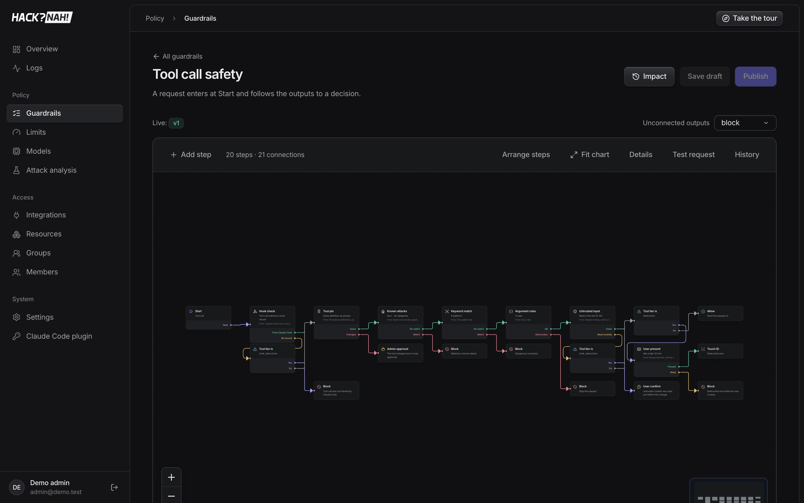

# 1 · Solution

**Hack?Nah!** is a control plane for AI coding agents (Claude Code first). Every model request, tool
call, tool result and subagent message goes through one gateway, which applies the organization's
guardrails, limits and access rules, and logs the decision.

**Approach**

- **One choke point, five stages:** model input, tool call, tool result, model output, agent message.
- **Policy as a graph:** visual editor or YAML, versioned (draft → publish). Paths end in allow,
  approval, block or skip. When several guardrails match, the strictest outcome wins.
- **Fast rules first, models where meaning matters:** deterministic checks run in microseconds;
  model-based judges are optional and have a fallback.
- **Evidence for every decision:** stage, path, cost and timing are stored per event, and
  labelled attack datasets are replayed after every change.



## Controls

| Control | What it does | Kind |
|---|---|---|
| Known attacks | 38 signatures: code execution, deserialization, supply chain, exfiltration, destructive commands. Survives base64 / unicode / split obfuscation | deterministic |
| Keyword match | Your own patterns (`rm -rf /`, `DROP DATABASE`, ...) | deterministic |
| Redact data | Secrets and PII (email, phone, IBAN, card, PESEL, IP) become placeholders before the model sees them, and are restored in tool arguments | deterministic |
| Trained model | Classifier trained on your datasets, runs inside the Worker | deterministic |
| Judge model | Risk score from Prompt Guard 2 (local), any OpenAI-compatible LLM, or System One | non-deterministic |
| Argument rules | Rules on tool arguments, e.g. email `to` must be `@company.com` | deterministic |
| Tool pin | Tool definition must match the approved one (tool poisoning, drift) | deterministic |
| Untrusted input / User present / Hook check | Session context: outside content read recently, someone at the keyboard, the call really came from Claude Code | deterministic |
| Device checks | Copied token, new device, OS security, EDR score, new network / impossible travel | deterministic |
| Approvals | Admin approval (live queue), user confirm, Touch ID, browser re-login | human |
| Model catalog | Only listed models; routes to Anthropic or OpenAI-compatible (Ollama, vLLM) upstreams | platform |
| Limits | Requests, concurrency, tokens, USD, GPU-seconds, per user / group / org; block, warn or hand off to a guardrail | platform |
| Access | MCP tools granted only via resources (server → tool globs) to users or groups | platform |
| Output guard | Streams with a 200-char hold-back; blocks or redacts mid-stream; withholds bad tool results | platform |
| Identity | DPoP-signed requests with a Secure Enclave key, 15-min device-bound tokens, session pinning | platform |

## Configuration

One YAML file holds **guardrails, limits and models**. It can be edited in the dashboard or managed as code:

```sh
pnpm policy:apply policies/balanced.yaml --dry-run   # preview
pnpm policy:apply policies/balanced.yaml [--merge]   # apply (new version + audit entry)
```

| Preset | Behaviour |
|---|---|
| [`permissive.yaml`](../policies/permissive.yaml) | Pilots: blocks only clearly destructive actions, budgets warn, fails open |
| [`balanced.yaml`](../policies/balanced.yaml) | **Default:** blocks known-bad, asks a person when unclear, redacts common PII, caps spend |
| [`strict.yaml`](../policies/strict.yaml) | Regulated: fails closed, admin approves new devices, redacts all PII, budgets block |
| [`config/recommended.yaml`](config/recommended.yaml) | The six guardrails measured in [4-testing](../4-testing/README.md) |

A guardrail in YAML:

```yaml
- name: Baseline
  definition:
    fallback: block
    nodes:
      - { id: start, type: trigger, stages: [] }
      - { id: device, type: check, check: { type: fingerprint } }
      - { id: dangerous, type: check, check: { type: keywords, patterns: ["rm -rf /", "curl * | sh"] } }
      - { id: allow, type: decision, action: allow }
      - { id: approve, type: decision, action: require_approval, method: admin }
      - { id: block, type: decision, action: block }
    edges:
      - { source: start, sourceHandle: next, target: device }
      - { source: device, sourceHandle: pass, target: dangerous }
      - { source: device, sourceHandle: new, target: approve }
      - { source: device, sourceHandle: mismatch, target: block }
      - { source: dangerous, sourceHandle: pass, target: allow }
      - { source: dangerous, sourceHandle: fail, target: block }
```

More screenshots: [screenshots/](screenshots) (guardrail graphs, impact replay, limits, models, access).
