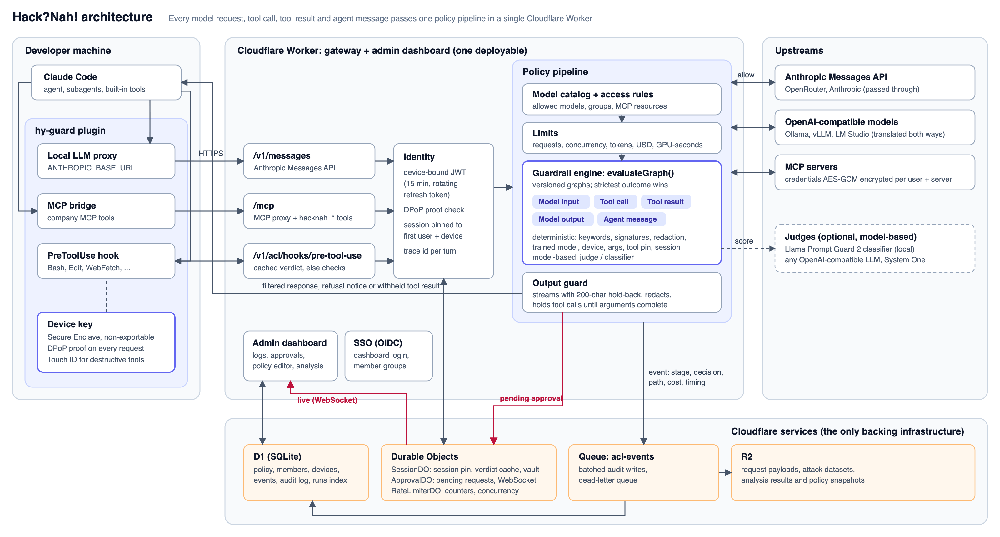

# 2 · Architecture

- **Plugin** ([`claude-plugin`](../claude-plugin)) routes Claude Code's model traffic, MCP tools
  and built-in tool calls (via a `PreToolUse` hook) to the gateway. Each request is signed with a
  Secure Enclave key.
- **One Cloudflare Worker** holds the gateway and the admin dashboard.
  - [`evaluateGraph()`](../packages/shared/src/engine.ts) is one pure function, used by the
    gateway, the editor's dry run, Attack analysis and the CLI test suite.
- **Cloudflare services only:**
  - D1: policy and events
  - Durable Objects: sessions, approvals, rate limits
  - Queue → R2: audit payloads, written off the request path

## Performance

Measured 2026-10-04, Apple M4 Pro, local Workers runtime. Raw output is in [`../4-testing/results`](../4-testing/results) and [`benchmarks/`](benchmarks).

### Deterministic (six recommended guardrails)

| | p50 | p95 | p99 | Throughput |
|---|---|---|---|---|
| Policy engine (Mixed check · 500) | 0.024 ms | 0.300 ms | 0.433 ms | 15.8K req/s per thread |
| Control suite (12,965 cases) | 0.02 ms | 0.21 ms | 0.42 ms | |
| Full gateway overhead, model request (real Worker, D1, DOs) | 1 ms | 11 ms | 14 ms | |
| Full gateway overhead, tool call / tool result / output | 0 ms | 0 ms | ≤1 ms | |

Detection on held-out data: **213/250 attacks blocked (85%), 4/250 benign blocked (1.6%)** on
Mixed check · 500. 16 of 1,270 normal requests blocked (1.3%).

### Non-deterministic (judge: Llama Prompt Guard 2, CPU)

| | p50 | p95 | p99 |
|---|---|---|---|
| Classifier per request | 16.7 ms | 413 ms | 670 ms |

On the same 500 rows at threshold 0.7: **98/250 attacks flagged, 4/250 benign flagged**. It is
strong on jailbreaks (60/67) and direct injection (32/67), and catches nothing on command-level
attacks.

**Takeaway:** the judge is about 700× slower than the deterministic checks and only helps on
meaning-level attacks. So the guardrails run signatures and the trained model first, and use judges
only where they add something, with a fallback and a spend limit. LLM judges over an API were not
benchmarked (no API key in the test environment).

Reproduce: [`benchmarks/judge-bench.mjs`](benchmarks/judge-bench.mjs).
