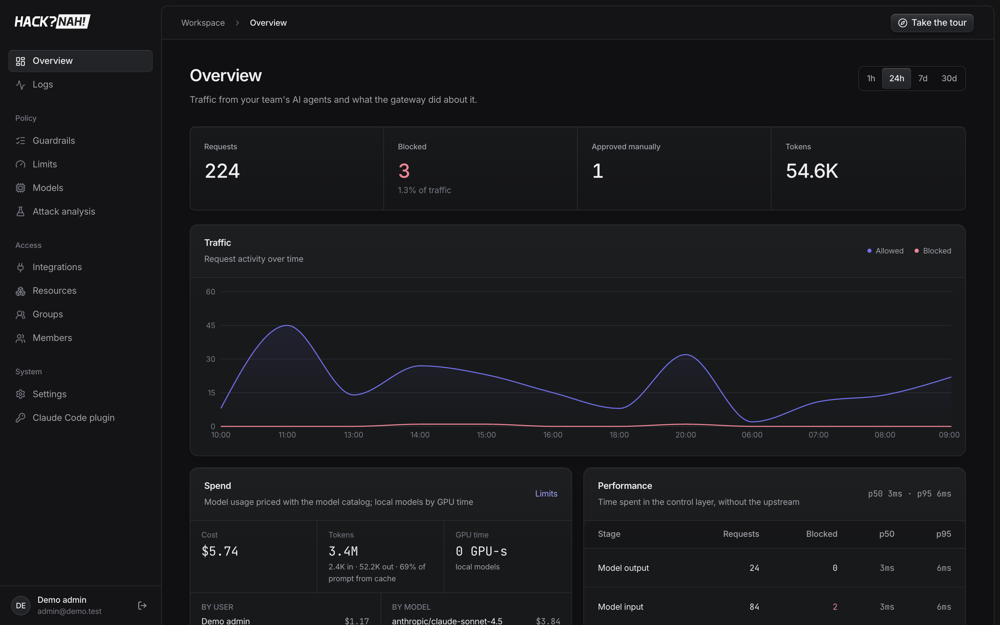
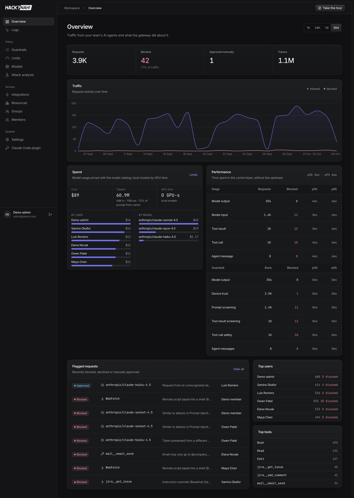
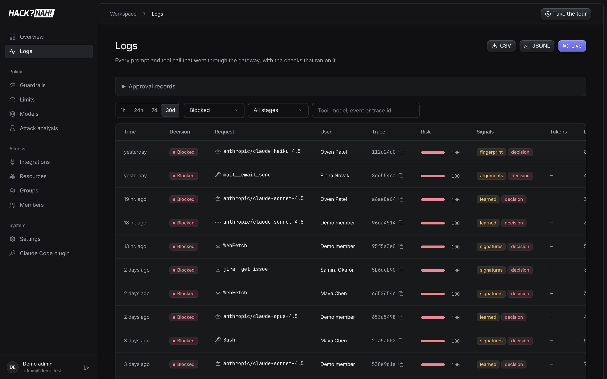
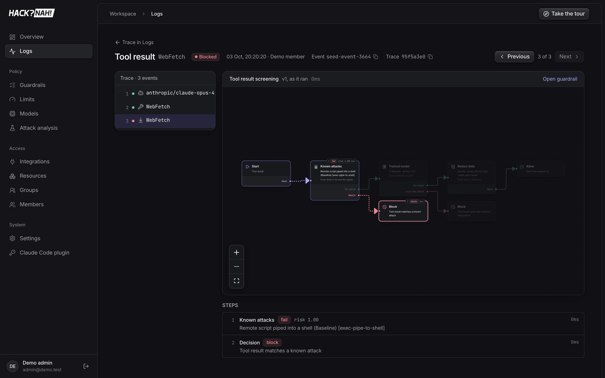
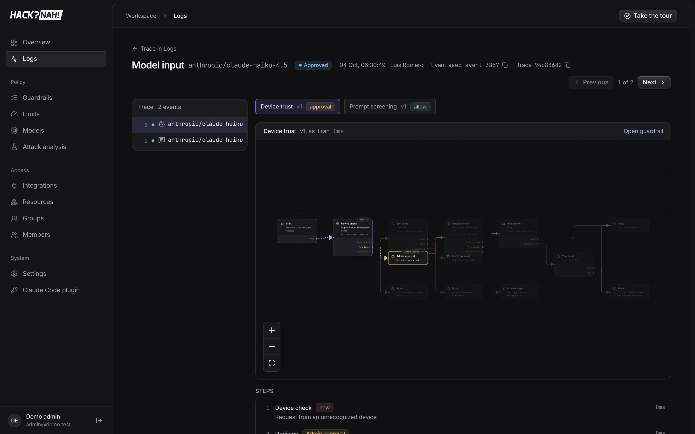
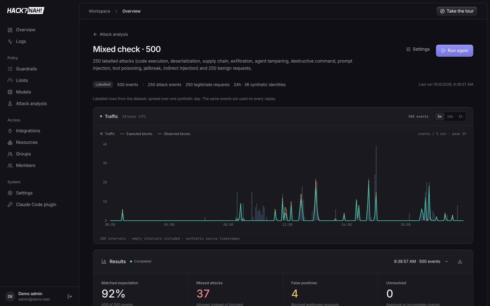
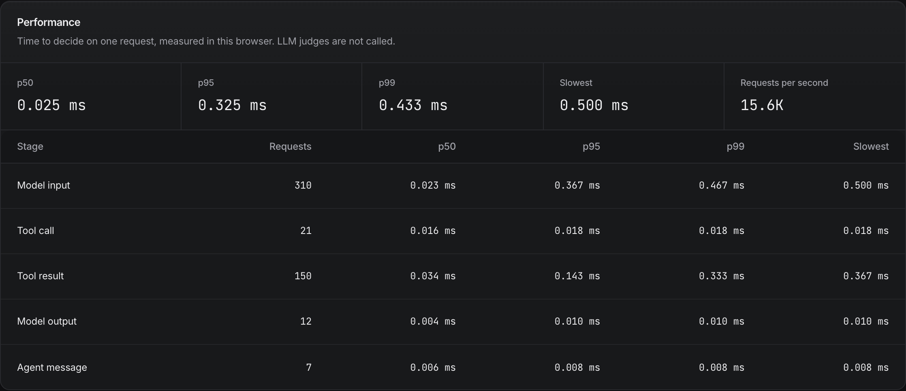
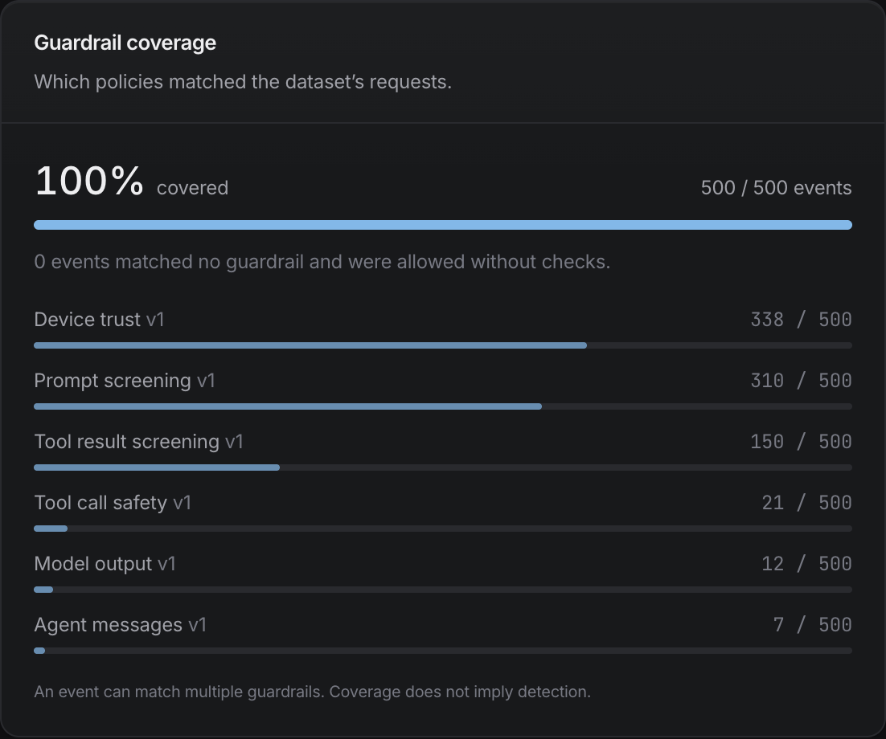
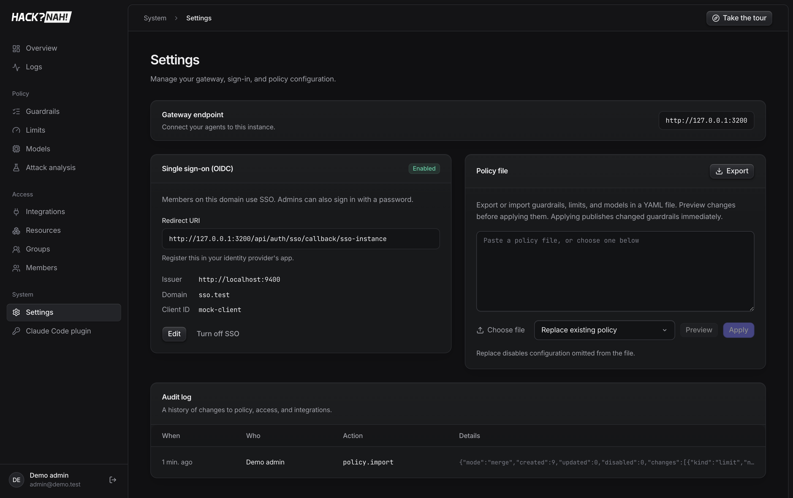

# 3 · Reporting

The admin dashboard is the main report. Screenshots come from the seeded demo instance: 30 days of
traffic from seven people, decided by the recommended guardrails.

## Metrics

| Where | Metrics |
|---|---|
| **Overview** (1h / 24h / 7d / 30d) | Requests, blocked (count and % of traffic), approved manually, tokens, traffic over time (allowed vs blocked) |
| **Spend** | Cost in USD, input/output tokens, prompt cache hit %, GPU-seconds for local models. Broken down by user and by model |
| **Performance** | Control-layer time (upstream excluded): p50/p95 overall, per stage and per guardrail, with runs and blocks |
| **Flagged / Top lists** | Recently blocked, declined or approved requests. Top users, top tools |
| **Logs** (per event) | Decision, stage, user, device, session, trace id, risk score, signals (which checks fired), tokens, cost, GPU time, overhead. CSV / JSONL export, live stream |
| **Event path** | The guardrail graph at the version that ran, with the path taken and each step's result and timing |
| **Limits** | Current usage against each limit (per user, group or org) |
| **Attack analysis** | Matched expectation %, missed attacks, false positives, unresolved, expected vs observed, guardrail coverage, latency p50/p95/p99 and req/s per stage |
| **Audit log** | Who changed which policy, access or integration, and when |

## Screenshots

| | |
|---|---|
|  Overview, 30 days (full page) |  Logs filtered to blocked |
|  Event path: injected tool result blocked |  New device, approved by an admin |
|  Attack analysis run |  Performance per stage |
|  Guardrail coverage |  Settings: SSO, policy file, audit log |
