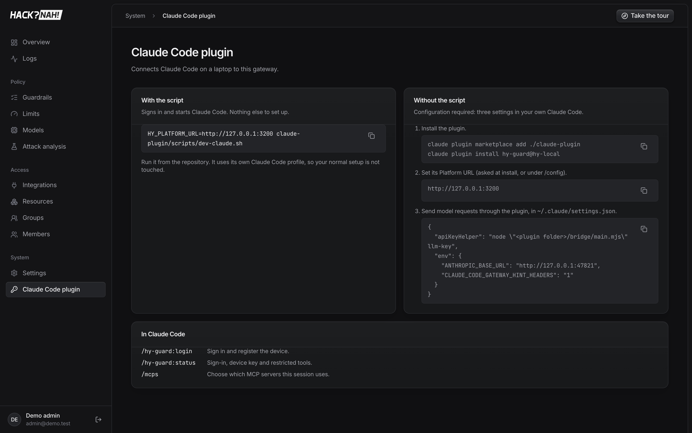

# 5 · Implementation

The code is the repository itself (TypeScript, pnpm + Turborepo). This page maps it out and explains
how to deploy it.

| Path | What it is |
|---|---|
| [`apps/web`](../apps/web) | The Cloudflare Worker: gateway (`src/gateway`, Hono) and dashboard (TanStack Start) |
| [`packages/shared`](../packages/shared) | Guardrail schema and engine, signatures, redaction, judge clients, limits |
| [`packages/db`](../packages/db) | Drizzle schema and D1 migrations |
| [`claude-plugin`](../claude-plugin) | hy-guard Claude Code plugin: DPoP signing, MCP bridge, hooks, LLM proxy |
| [`services/classifier`](../services/classifier) | Optional Prompt Guard 2 judge service |
| [`policies`](../policies), [`dataset`](../dataset), [`scripts`](../scripts) | Policy presets, labelled attack data, control suite, e2e suite, policy CLI |

## Deploy

```sh
cd apps/web
npx wrangler d1 create acl && npx wrangler r2 bucket create acl-payloads
npx wrangler queues create acl-events && npx wrangler queues create acl-events-dlq
npx wrangler secret put JWT_SECRET   # also BETTER_AUTH_SECRET, ENCRYPTION_KEY, provider keys
pnpm db:migrate:remote && pnpm --filter @acl/web run deploy
```

CI ([`.github/workflows/ci.yml`](../.github/workflows/ci.yml)) runs lint, typecheck, tests and the
build on every PR, and migrates and deploys on `main`.

## Fitting into an existing agent setup

| You already have | How Hack?Nah! plugs in |
|---|---|
| **Claude Code on laptops** | Ship the plugin with managed settings (`ANTHROPIC_BASE_URL` → local proxy, `apiKeyHelper`). Users run `/hy-guard:login` once. No other software |
| **Model providers** | Add them to the model catalog: Anthropic/OpenRouter (passed through) or OpenAI-compatible (Ollama, vLLM, LM Studio). Provider keys stay in the gateway, never on laptops |
| **MCP servers** (Jira, Confluence, Datadog, internal) | Register them as integrations. Credentials are encrypted per user and server. Grant tools through resources to groups |
| **Identity provider** | OIDC SSO: people on your domain sign in with it and join as members. Removing a member revokes their devices |
| **EDR / device management** | Device checks read CrowdStrike ZTA posture and OS security from the plugin |
| **Policy-as-code / GitOps** | Keep the YAML in a repo; CI runs `pnpm policy:apply --dry-run` on PRs and applies on merge |
| **SIEM** | Export logs as CSV / JSONL. Every event has trace, user, device and decision |
| **Admin automation / agents** | The built-in `hacknah_*` MCP tools let an admin's agent inspect, edit and publish guardrails and run analyses, with the same audit trail |



## Considerations

- **Latency budget.** Deterministic checks cost microseconds. Judges cost 15–700 ms, so they run
  only on paths that need them, behind a fallback.
- **Fail open vs fail closed** is set per guardrail. The presets show both.
- **Privacy.** Redaction happens before the model sees the data. Payloads are stored in your own R2
  bucket, and the platform tools never copy them into audit records.
- **Scale.** Workers, D1, Queues and Durable Objects scale horizontally. Per-session and per-limit
  state lives in Durable Objects, so counters stay consistent without a central database lock.
- **Not done yet:** email invitations, device-bound dashboard sessions (DBSC), SSO domain
  verification, LLM-judge benchmarks over a hosted API.
