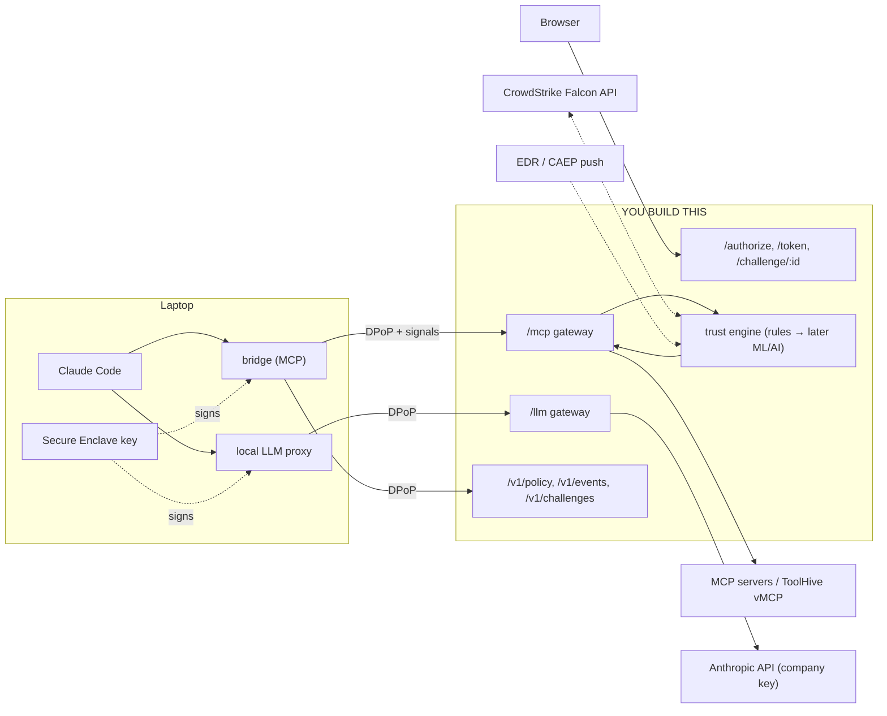

# hy-guard platform: guide for implementing the backend

This guide is for whoever (human or coding agent) implements the **server side** of hy-guard in this repository. The client side, the Claude Code plugin in `claude-plugin/`, is finished. The backend has to speak the protocol that plugin expects, so the plugin can be pointed at it **without any change on the client**.

**Status:** the backend in `apps/` isn't integrated with the plugin yet. Until it is, the plugin runs against its own mock platform (`claude-plugin/mock-backend/`).

## Read in this order (paths from the repository root)

1. **This file:** what the system is, what you build, in which order, and how to verify it.
2. **`claude-plugin/docs/BACKEND_CONTRACT.md`:** the wire protocol. Every endpoint, header, claim, error and table. **It is the source of truth**; if this file and the contract disagree, the contract wins.
3. **`claude-plugin/docs/TEST_VECTORS.md`:** exact inputs and outputs for canonical JSON, thumbprints, hashes, a DPoP proof, a response signature and PKCE. Turn them into unit tests first.
4. **`claude-plugin/contract/types.ts`:** TypeScript shapes of every payload.
5. **`claude-plugin/mock-backend/`:** the mock platform, a working, readable implementation of everything here. When the contract is ambiguous, the mock shows what the plugin actually expects:
   - `dpop.mjs`: DPoP verification, nonces, replay cache, presence proofs;
   - `response-signing.mjs`: `HY-Response-Signature`;
   - `rules.mjs`: the trust decision;
   - `posture.mjs`: CrowdStrike ZTA tokens;
   - `falcon.mjs`: the Falcon API client and CAEP events;
   - `server.mjs`: all routes.

   Don't copy its storage, its demo shortcuts (auto-approve, `X-Mock-Client-IP`, account buttons instead of SSO) or its single-process nonce/jti state.

## What hy-guard is (client side, already built)

A Claude Code plugin that puts a company's AI agent traffic under device-bound, policy-checked control:

- **Device key:** generated in the Mac's Secure Enclave (non-exportable; a software key on Linux). It signs **every request** to the platform (DPoP, RFC 9449, extended with a body hash and more claims). A stolen access or refresh token is useless without that key.
- **Sign-in:** OAuth 2.0 code + PKCE with a loopback redirect. The browser shows SSO plus "approve this device (code `ABCD-EFGH-IJKL`)". Tokens are bound to the key's thumbprint.
- **Tool traffic:** Claude Code → the plugin's bridge (stdio MCP server) → **your MCP gateway** (`/mcp`, DPoP on every call) → company MCP servers (ToolHive vMCP later).
- **Model traffic:** Claude Code → a local signing proxy (`127.0.0.1`) → **your LLM gateway** (`/llm/*`, DPoP on every call) → Anthropic (or Bedrock/Vertex) with the company key. The laptop has no Anthropic login.
- **The plugin also sends** a device fingerprint, client context, user idle time, built-in OS posture (FileVault, SIP, Gatekeeper, firewall), a CrowdStrike ZTA posture token when present, and Claude Code hook records ("this tool call was started by Claude Code session X"), all inside the signed proof.
- **Approvals:** per tool, from your policy: `none`, `confirm` (a dialog in Claude Code), `touchid` (a Touch ID-signed presence proof), `browser` (your approval page with a fresh sign-in).
- **The plugin verifies your responses** (`HY-Response-Signature`, platform key pinned on first contact).



## What the backend owns

1. **Identity:** SSO sign-in, device registration and approval, key-bound tokens, refresh, the session unlock window, revocation.
2. **Proof verification on every request:** DPoP, nonces, replay cache, body hash, fingerprint, client context, presence proofs.
3. **Policy:** serving it, and **enforcing it server-side**: hidden tools, argument rules, admin pins, approval levels.
4. **The trust decision for each tool call:** allow, challenge or deny, with reasons and an audit trail.
5. **Gateways:** forwarding allowed MCP calls and model requests, unchanged, with your own credentials.
6. **Challenges:** the approval page with a fresh sign-in, and the status endpoint the plugin polls.
7. **Signals:** events, EDR posture (ZTA file, Falcon cross-check, CAEP push), theft detection.
8. **Signed responses** with a stable, published key.

## Security invariants (never relax these)

- **The client is not trusted.** Everything the bridge checks locally (hidden tools, argument rules, pins, approval levels) is checked again server-side. The only exception is the `confirm` approval level, which is UX and can't be proven.
- **No proof, no access:** every protected request needs a valid DPoP proof whose key thumbprint equals the token's bound `jkt`. That includes `initialize`, notifications, policy, events, challenges and `/llm`.
- **Replay:** `jti` is single use for 5 min, `iat` within ±60 s, nonces are server-issued and rotating. In multi-instance deployments, nonces and the jti cache are **shared** (Redis/Valkey).
- **Bind everything to the request:** `htu` is the public URL (scheme + host + path, no query), `htm` the method, `ath` the token, `bh` the body.
- **Deny, never "assume healthy":** an unreachable dependency (Falcon, the trust engine, the IdP) means unknown. Unknown means challenge or deny for write/destructive, never allow.
- **Posture before approvals:** a compromised device is denied even if a human approves.
- **Fresh sign-in for browser approvals:** a remembered SSO session must not approve (`prompt=login` / `max_age=0`), and only the device's own user may approve.
- **Theft is an event:** a valid token with the wrong key, a refresh from another machine, or re-registering a known key from another fingerprint is refused **and** logged as theft against the owning device.
- **The response-signing key is stable** (KMS/HSM). Rotating it breaks every pinned client unless you ship the new thumbprint via managed settings.
- **HTTPS everywhere.** The plugin refuses `http://` except on localhost, including URLs inside your discovery document.

## Build plan (milestones)

Each milestone ends in something you can test. The plugin needs M1–M4 to be usable at all.

| # | Build | Done when |
|---|---|---|
| **M1** | Discovery (`/.well-known/hy-platform`), nonce issuance on every response, the DPoP verifier (contract §3), response signing (§3b), canonical JSON + hashes | all of `TEST_VECTORS.md` pass as unit tests; every response has `DPoP-Nonce`; responses to DPoP requests carry `HY-Response-Signature` |
| **M2** | `GET /authorize` (SSO + device approval page with the device code), `POST /token` (code + PKCE + `dpop_jkt`, fingerprint, presence key; refresh with unlock window), the devices/tokens tables | the plugin signs in (`HY_PLATFORM_URL=<backend> node plugin/bridge/main.mjs login`, run in `claude-plugin/`) and refreshes silently |
| **M3** | `GET /v1/policy` (ETag/304), `POST /v1/events` (202, dedupe by `event_id`) | the plugin loads your policy; events arrive |
| **M4** | MCP gateway: `initialize` + `Mcp-Session-Id` bound to the device, `tools/list` without hidden tools, `tools/call` with server-side enforcement (hide/deny, argument rules, admin pins), trust decision, JSON-RPC errors `-32010` (challenge) / `-32011` (deny), forwarding to MCP servers | Claude Code with the plugin lists and calls your tools; a hidden tool never appears; an external email address is denied |
| **M5** | Challenges: `GET /v1/challenges/{id}` and the approval page (details first, fresh sign-in, owner only; JSON answers for `fetch`); `HY-Challenge-Id` retry, bound to the action hash, single use | browser approvals work end to end; another account gets 403 |
| **M6** | LLM gateway `/llm/*`: DPoP, forwarding with the company key, unbuffered SSE, posture gate (403 `permission_error`), `llm_auto_mode_server` in discovery | Claude Code chats through you with no Anthropic login; auto mode works |
| **M7** | Theft detection and admin: rejections log, `theft_suspected_at`, revoke, lock (unlock window to 0) | `claude-plugin/scripts/steal-session.sh` against your backend is refused and flagged |
| **M8** | Posture: `HY-Posture-ZTA` (`ztah`, agent ID pinning), Falcon cross-check (lower score wins, containment), CAEP receiver, `osp` rules | lowering the score or raising a detection cuts the device off on the next request |
| **M9** | Risk signals in the decision: untrusted content (from `pre_tool_use` events, **flushed by the bridge before write calls**), known networks and travel, hook correlation, idle time; later ML/AI scores (**AI may only raise risk**) | the decision log shows signals and reasons per call |

## Verifying against the real plugin

From `claude-plugin/` (Node ≥ 20; macOS for the Secure Enclave):

```sh
cd claude-plugin
HY_PLATFORM_URL=https://your-backend.example.com scripts/dev-claude.sh --fresh
```

That's a separate Claude Code profile, signed in through **your** `/authorize`, with model and tools through **your** gateways. Then:

| In Claude Code | Expect from your backend |
|---|---|
| `status` (the plugin's `hy_status` tool) | sign-in, device code, policy version |
| a read tool | allow; decision logged with `hook_correlated: true` |
| a `confirm` tool | the plugin's own dialog; your side sees a normal call |
| a `touchid` tool | a request with `HY-Presence-Proof`; deny without it on Touch ID devices |
| a `browser` tool | `-32010`, the page opens, fresh sign-in, approve → the retry with `HY-Challenge-Id` passes once |
| `scripts/steal-session.sh` (another terminal) | 401 for every request, a theft row, the victim device flagged |

The plugin's automated tests (`cd claude-plugin && npm test`) run against the **mock**, which is the executable spec. Comparing your responses with the mock's for the same requests is the fastest way to find a mismatch.

## Gotchas (real ones, found while building the plugin)

- **`htu` behind a reverse proxy:** compare against your **public** base URL, never the internal host or port.
- **Signatures are JWS ES256:** raw `r||s` (64 bytes), not DER. Base64url **without padding** everywhere.
- **Canonical JSON:** sorted keys, no whitespace (§1 of the vectors). Hash the bytes you received when the contract says so (`ctxh`, `bh`), not a re-serialisation.
- **Nonce on 400 from `/token`:** a missing nonce at the token endpoint is `400 {"error":"use_dpop_nonce"}` plus `DPoP-Nonce`; at resource endpoints it's 401 with `WWW-Authenticate: DPoP error="use_dpop_nonce"`. The plugin handles both.
- **Sign error responses too:** 401, 403, 304 (empty body: `bh` of the empty string). A missing signature makes the plugin assume a man-in-the-middle.
- **Streams aren't signed:** `text/event-stream` (model streaming) is relayed unbuffered and unsigned; everything else is signed.
- **The loopback redirect uses any port** (`http://127.0.0.1:<random>/callback`); accept only loopback, any port.
- **The device code is display-only.** Never accept it as authentication.
- **Action hash** = SHA-256 of canonical `{"tool","arguments"}`. It binds challenges and hook records; the JSON-RPC `id` differs on retries, so never hash the whole body for that.
- **Events are at-least-once:** deduplicate by `event_id`.
- **`tools/call` order matters:** hide/deny → argument rules → pins → posture → approved challenge → approval levels → risk signals (contract §8).
- **Locked Macs:** the device key only works while the Mac is unlocked. Bursts of failed requests from a laptop that went to sleep are normal, not an attack.

## Configuration the backend should expose

Policy (per org/group/user: tool rules, approval levels, argument rules, pins), the unlock TTL (default 8 h), token lifetimes (access 5–10 min, refresh 8–12 h), posture thresholds (20 / 50), the fingerprint mode (`enforce`/`log`), `llm_auto_mode_server`, the CAEP shared secret or transmitter keys, Falcon API credentials and tenant (CID), the upstream model credentials, the challenge TTL (120 s), the untrusted-content window (10 min) and the idle limit (30 min).

## Left to you (the plugin works either way)

- **Token format:** opaque or JWT with `cnf.jkt` (needed if ToolHive vMCP validates tokens directly).
- **Refresh token rotation:** the plugin re-reads its token file before treating a failed refresh as a sign-out.
- **Storage:** Postgres for durable state, Redis/Valkey for nonces and jti, an analytics store for events.
- **The ToolHive vMCP integration:** pass-through of a trusted JWT, or token exchange (RFC 8693). **vMCP must only be reachable from your gateway.**

## Out of scope for the backend

Everything inside `claude-plugin/plugin/`: key storage, Touch ID, the bridge's local checks, Claude Code hooks, the in-Claude-Code cards, the local proxy. The plugin is done; don't change it to fit the backend. If something truly can't be served as specified, write down why and propose a contract change rather than a workaround.
